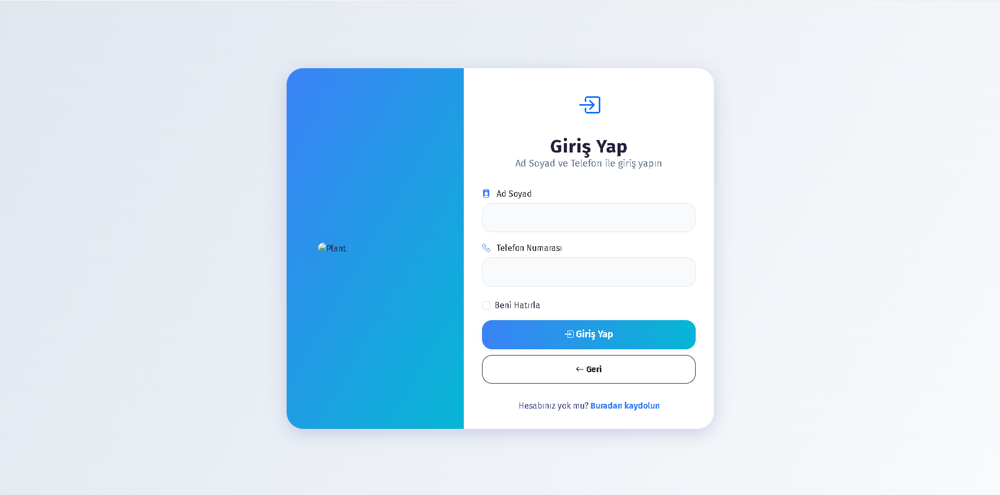

# Appointment System

This project is a web application developed for businesses operating with appointments, allowing users to book and manage appointments online.

## Technologies Used

- **PHP** – Server-side programming language  
- **MySQL** – Database management system  
- **HTML** – Web page structure  
- **CSS** – Page design and styling  
- **JavaScript** – Dynamic interactions and functions  
- **Bootstrap Icons** – UI icons  

## Screenshots

<h3>Sign-In Page </h3>

  
  
  

<h3>Sign-Up Page </h3>

  

<h3>Admin Login Panel </h3>

  
  
  

<h3>Customer Homepage </h3>

  
  
  
  
  

<h3>My Appointments Page</h3>

  
  

<h3>Create Appointment Page </h3>

  

<h3>Working Hours & Holidays Page</h3>

  

<h3>Appointment History Page</h3>

  

<h3>Update Profile Page</h3>

  

<h3>Admin Dashboard </h3>

  
  
  
  
  
  

<h3>Manage Appointments (Admin) </h3>

  
  

<h3>View Customers (Admin)</h3>

  

<h3>Manage Working Hours & Holidays (Admin) </h3>

  

## Features

### For Users  
- Register and log in  
- Create, view, and cancel appointments  
- View appointment history  
- Update profile information  
- Password reset _(planned)_  
- Appointment reminders _(planned)_  
- Recurring appointments _(planned)_  

### For Staff/Admin  
- Approve or reject appointment requests  
- Edit or cancel appointments  
- Manage working hours and holidays  
- View customer list and history  
- Reporting and statistics  

### General  
- Multi-language support (TR/EN)  
- Mobile-responsive interface  
- Comments and reviews _(planned)_  
- Notification panel _(planned)_  

## Requirements

- XAMPP (recommended) or any equivalent web development environment  

## Installation

1. Clone this repository into the `htdocs` directory of your XAMPP installation.  
2. Start **Apache Web Server** and **MySQL Database** via the XAMPP control panel.  
3. Open the `sqlDatabase.sql` file and copy its contents.  
4. Go to `localhost/phpmyadmin` in your browser.  
5. In the top menu, click the `SQL` tab, paste the copied SQL code, and run it.

## Usage

1. If not already running, start **Apache** and **MySQL** via XAMPP.  
2. Navigate to `localhost/randevu-sistemi/` in your browser.  
3. Log in with an existing user or create a new account.  
4. To create an appointment, select a suitable date and time.  
5. Admin users can log in to view and manage appointment requests.  
6. Users can view, update, or cancel their appointments as needed.  

## Contact

If you have any questions, suggestions, or feedback, feel free to reach out:

- [LinkedIn](http://www.linkedin.com/in/yusuf-burkuk-390b4027a)  
- [Email](mailto:yusufbrkk12@gmail.com) – yusufbrkk12@gmail.com  

## Contribution

If you’d like to contribute, feel free to submit a pull request or open an issue.

## Notice

Some parts of the codebase are intentionally not shared publicly due to security and privacy considerations. As a result, the application may not work fully out of the box. If you encounter any issues or need assistance, feel free to contact me.
